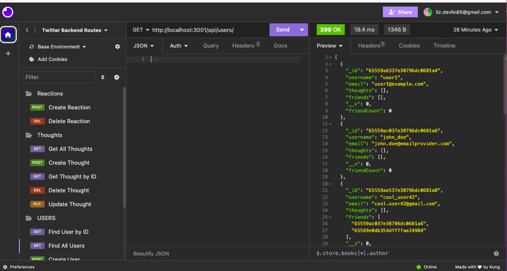

#Liz Makes a Social Network Backend

 

  ## Description: 
  this project is the back end of a twitter-style social networking application.

  ## Table of Contents: 
  * [installation](#installation)
  * [contact](#contact)
  * [license](#license)

  ## Installation: 
  once the code is opened on a server it can be viewed and interacted with through the insomnia application where users can share throughts and reactions.
  
  Watch a demo [HERE](https://watch.screencastify.com/v/LuZoCUaDVLyNNbnA6xqn)!
  
  ## Contact:
  [@lizfischestix](https://github.com/lizfischstix)
  ## License:
    This project is licensed under the MIT license